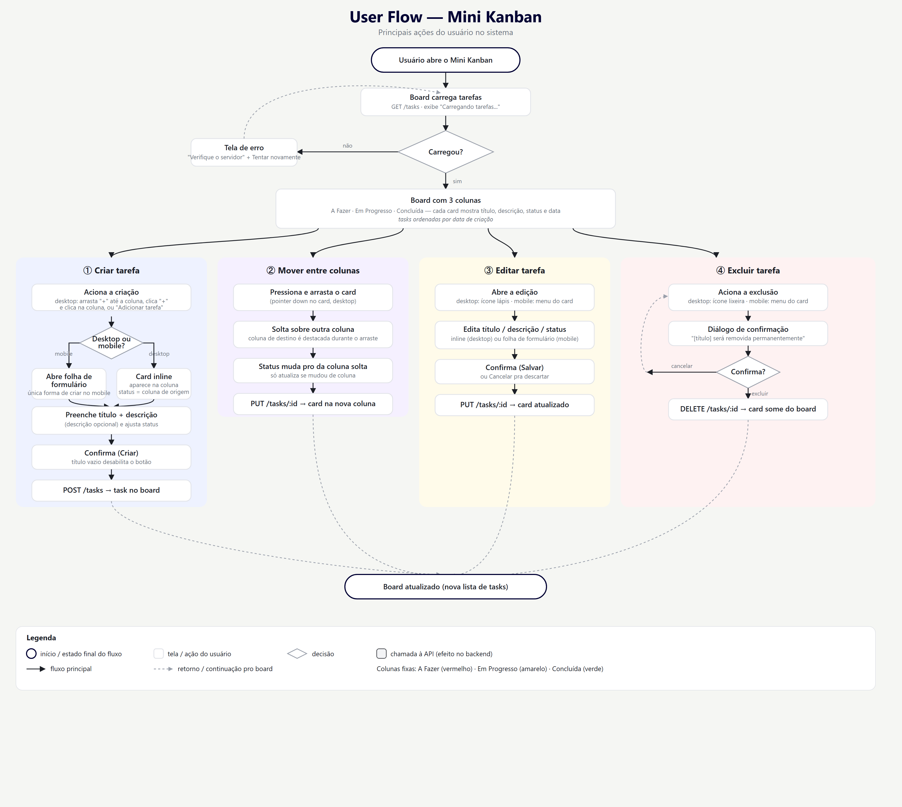

# Veritas — Mini Kanban

Backend em Go + frontend em React/Vite para um quadro Kanban simples.

## Documentação

- [User Flow](docs/user-flow.png) — principais ações do usuário no sistema
  (criar, mover, editar e excluir tarefas, incluindo os fluxos de erro e as
  diferenças entre desktop e mobile).



## Rodando com Docker

Pré-requisito: Docker (com Compose v2).

```bash
docker compose up -d --build
```

- Front: http://localhost:3000
- Back: http://localhost:8080

As tasks ficam persistidas em JSON num volume nomeado (`back-data`), então
sobrevivem a `docker compose restart`/`down` (sem `-v`). Para apagar tudo:

```bash
docker compose down -v
```

### Variáveis de ambiente

| Serviço | Variável | Onde se aplica | Padrão no compose |
| --- | --- | --- | --- |
| back | `PORT` | runtime | `8080` |
| back | `CORS_ORIGIN` | runtime | `http://localhost:3000` |
| back | `DATA_FILE` | runtime | `/data/tasks.json` |
| front | `VITE_API_URL` | **build time** (embutida no bundle, não é lida em runtime) | `http://localhost:8080` |

Se publicar o front em outra porta/host, ajuste `VITE_API_URL` (build arg do
serviço `front` no `docker-compose.yml`) e `CORS_ORIGIN` (env do serviço
`back`) para apontarem um pro outro.

## Rodando localmente (sem Docker)

**Backend** (Go 1.26+):

```bash
cd backend
go run .
```

**Frontend** (Node 24+, pnpm):

```bash
cd front
pnpm install
pnpm dev
```

Copie `backend/.env.example` → `backend/.env` e `front/.env.example` →
`front/.env` para customizar portas/URLs localmente (essas variáveis não são
lidas automaticamente pelo Go — sirva de referência, exporte-as você mesmo se
precisar mudar os padrões).

## Decisões técnicas

- **Backend em stdlib puro** (`net/http`, sem framework): o escopo é pequeno
  o bastante pra não precisar de Gin/Echo/etc., e evita mais uma dependência
  pra manter atualizada.
- **Inversão de dependência na persistência**: `storage.TaskStore` depende de
  uma interface `Persister` (`Load`/`Save`), não de um arquivo JSON
  específico. Testes usam um `NoopPersister`; produção usa
  `JSONFilePersister` (grava em arquivo temporário + `rename` atômico, pra
  não corromper o arquivo se o processo cair no meio da escrita).
- **Inversão de dependência nos handlers**: `handlers.TasksHandler` depende
  de uma interface `TaskRepository` (definida no próprio pacote `handlers`,
  seguindo o idioma Go de "quem consome define o contrato"), não do tipo
  concreto `*storage.TaskStore`.
- **Contrato da API em snake_case, domínio do front em camelCase**: o
  backend segue a convenção Go/JSON usual (`created_at`); o front mapeia
  isso pra um tipo de domínio (`createdAt`) numa única borda
  (`lib/taskMapper.ts`), então os componentes nunca lidam com o formato de
  transporte diretamente.
- **Criação de task sem modal no desktop**: arrastar o botão "+" até uma
  coluna (ou clicar e depois clicar na coluna) abre um card inline naquela
  coluna já com o status certo pré-selecionado. No mobile, sem colunas lado
  a lado, o "+" abre uma folha de formulário.
- **React Query pra estado de servidor**: cache, invalidação e os estados de
  loading/erro do board vêm do `@tanstack/react-query`, sem estado global
  próprio pra tasks.
- **Docker multi-stage**: backend compila pra um binário estático
  (`CGO_ENABLED=0`) rodando numa imagem `distroless` sem shell, como usuário
  não-root. Frontend builda os assets estáticos e serve via nginx.

## Possíveis melhorias

O escopo atual é deliberadamente pequeno (desafio técnico). Pra evoluir pra
algo mais próximo de produção, os próximos passos seriam:

**Backend**
- Migrar pra uma arquitetura mais escalável (camadas mais claras de
  domínio/serviço/infra, ou separar em serviços caso o escopo cresça).
- Adotar bibliotecas/frameworks mais robustos onde fizer sentido (ex.: um
  router mais completo, um validator, um logger estruturado) — hoje é Go
  stdlib puro de propósito, dado o tamanho do projeto.
- Persistência em banco de dados (Postgres/SQLite) no lugar do arquivo JSON,
  com migrations — necessário pra concorrência real e múltiplas réplicas.
- Autenticação/login (e autorização por usuário — hoje é um board único e
  compartilhado, sem controle de acesso).
- Melhorar os logs: formato estruturado (JSON), níveis (debug/info/error),
  correlação por request.
- Padronizar as respostas da API: um envelope de resposta consistente pra
  sucesso/erro, paginação, versionamento.
- Pipeline de CI (lint + `go test` + `pnpm test` a cada push).
- Reordenação manual de tasks dentro da mesma coluna (hoje a ordem é sempre
  por data de criação) e campos adicionais (data de vencimento, prioridade,
  etiqueta, responsável).

**Frontend**
- Criação de mais funcionalidades no board (filtros, busca, histórico de
  atividade).
- Aumento de páginas (múltiplos boards, configurações, login) usando React
  Router — hoje é uma única tela, então não há roteamento.
- Testes de componente/integração (hoje cobre só a lógica pura — mapeamento
  API↔domínio, formatação de data; o backend tem cobertura bem mais ampla).
- Acessibilidade (a11y) e internacionalização, se o público exigir.
